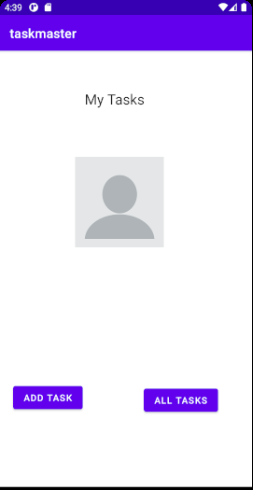
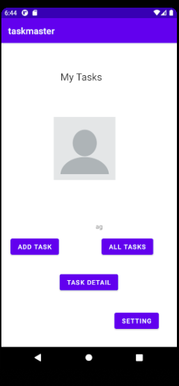

# taskmaster
### Lab: 26:
- in this lab we created a three pages:
      - homepage: which include the profile photo, and two buttons connected to on click listener that redirect the user to the other pages.
      - Add Task page: two text editor (input label); one for insert title and the other one for insert the body conetnts. at this stage the submit button will only show label once press, and in the next labs other functionality will add.
      - All Tasks page: in this page nothing added till now.

  - 

# Lab: 27:
- in this lab we created new two pages
      - task details:  include a title, and body with Lorem Ipsum content
      - setting page: that accept the user name and render it to the homepage.

- 
 ## Lab: 28 - RecyclerView
in this lab we created a recycle view for diplay a list of data at the all list page.
 - 